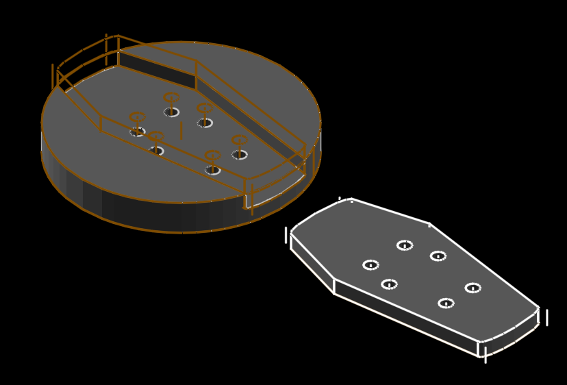

# coffin-button ⚰️+🔘

well i needed a button for my winter coat, and i've been going hard with coffin-shaped thingz recently. there was a revision that had a hole in the middle and i hoped it could be a 45rpm adaptor for recordz with a big hole. but i didn't leave enough tolerance room. 🤷

__note:__ scale this to smaller size(z) for smaller buttonz, but beware that a needle eyelet might not fit thru the hole 🥺

[coffin-button.stl](coffin-button.stl)

[coffin-button.html](coffin-button.html)
