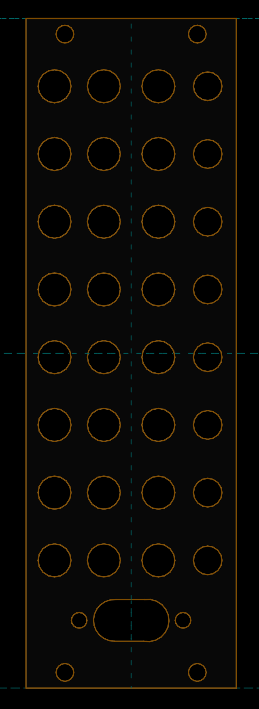

# midi2cv-face-plate

a front panel for my d.i.y. usb midi2cv eurorack module _see also:_ [edwardsharp/midi2cv](https://github.com/edwardsharp/midi2cv). made with [solvespace](http://solvespace.com).

[midi2cv-face-plate.stl](midi2cv-face-plate.stl)

[midi2cv-face-plate.html](midi2cv-face-plate.html)
