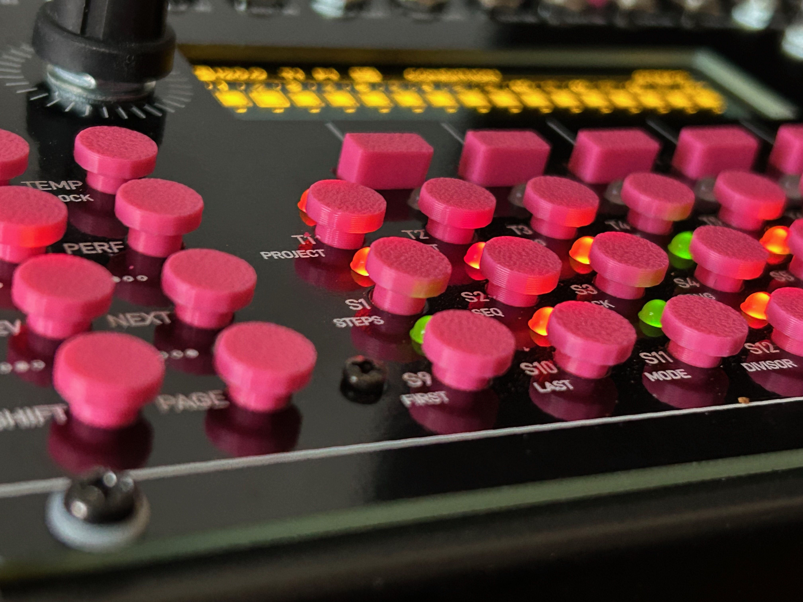
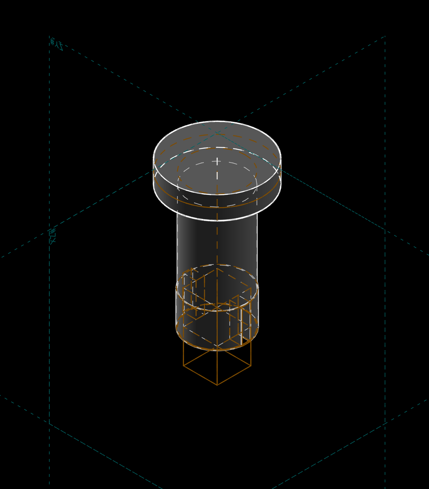
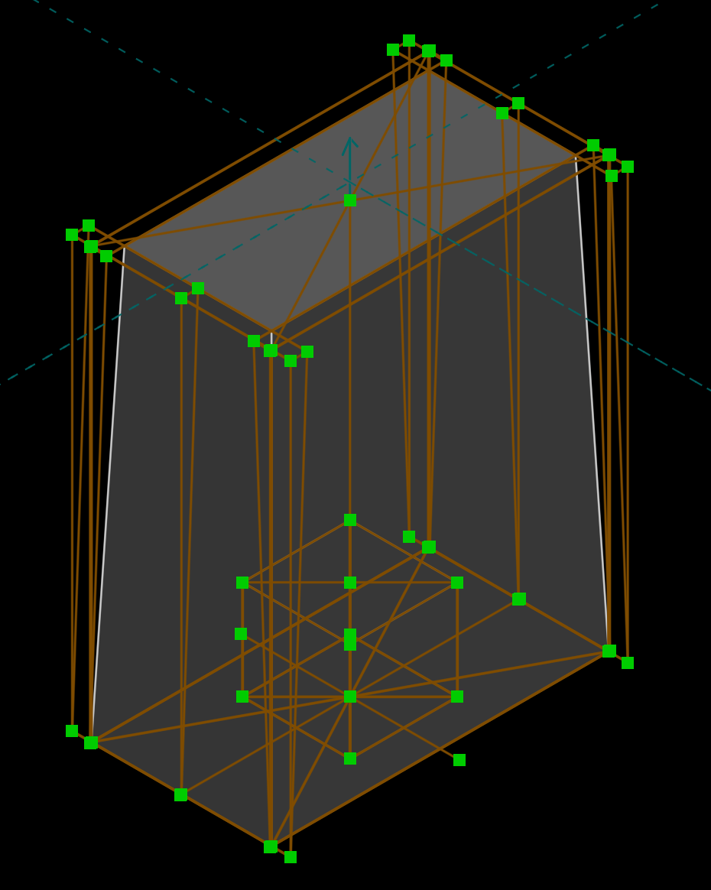
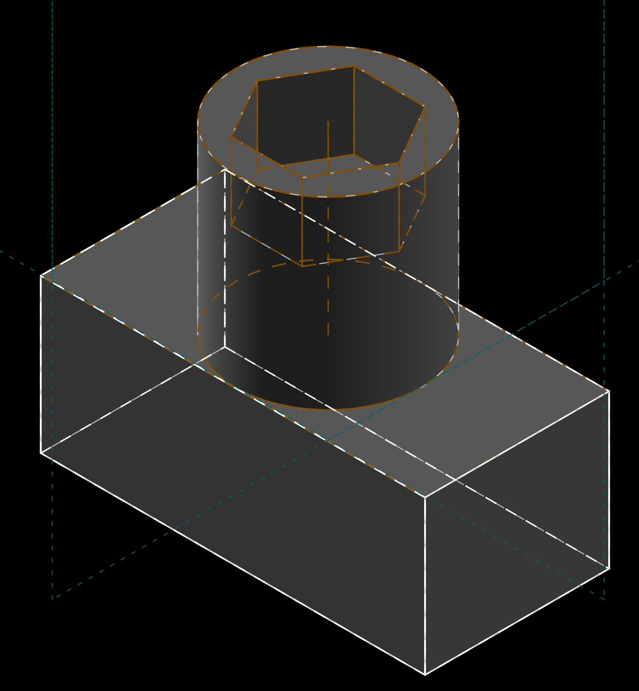

# performer-bttnz

so these are some taller/bigger/better(imho) buttons for the [westlicht performer](https://westlicht.github.io/performer/) eurorack module.

## parts

[performer_button_rev3.stl](performer_button_rev3.stl) print 32 of these

[performer_button_rev3.html](performer-bttnz/performer_button_rev3.html)

[performer_fn_button.stl](performer_fn_button.stl) print 5 of these

[performer_fn_button.html](performer-bttnz/performer_fn_button.html) 3d render

[8mm hex.stl](8mm hex.stl) optionally, print 1 of these to make taking the small nutz off all the 3.5mm jackz _way_ easier. NOTE: before print, scale this 5-10% bigger for better tolerence/fit.

[8mm hex.html](performer-bttnz/8mm hex.html) 3d render
